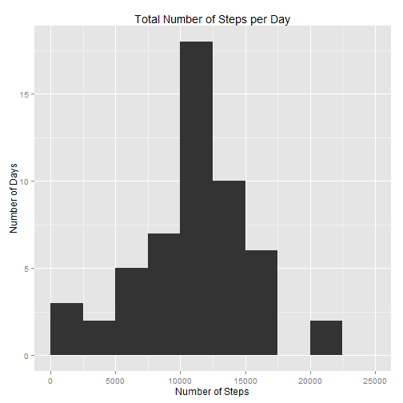
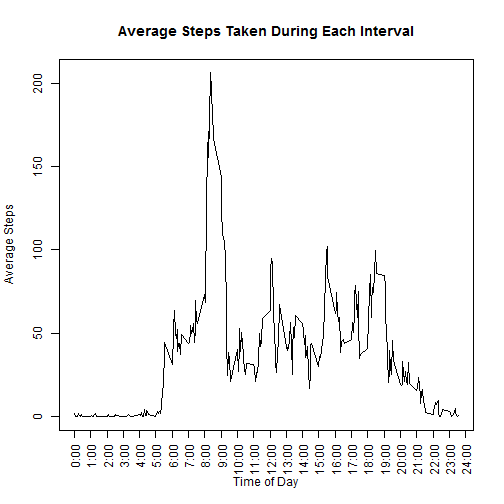
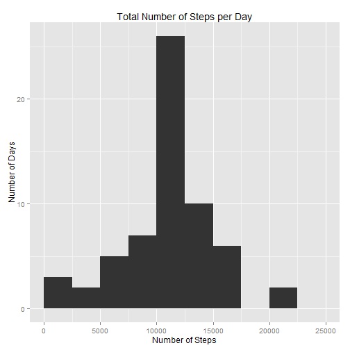
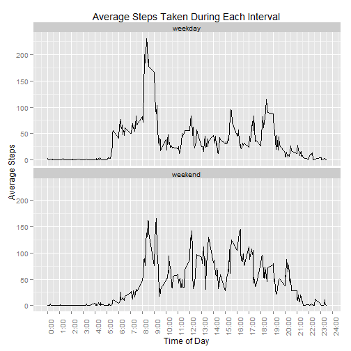

This data represents an analysis of activity monitoring data available [here](https://d396qusza40orc.cloudfront.net/repdata%2Fdata%2Factivity.zip).

Variables included in this dataset:

- steps: Number of steps taken in a 5-minute interval
- date: Date on which the measurement was taken (10/2012-11/2012)
- interval: 5-minute period during which the measurement was taken.

####Loading and preprocessing the data####
First, we set the fileUrl, download and unzip the file. Then we read the file in using read.csv.

NOTE: Rmd doesn't seem to like downloading zip files in https (Stack Overflow citation [here](Stack Overflow: http://stackoverflow.com/questions/25341285/error-when-knitr-has-to-download-a-zip-file)), so I manually change the URL to http.


```r
#Original
fileUrl = "https://d396qusza40orc.cloudfront.net/repdata%2Fdata%2Factivity.zip"

#Edited
fileUrl = "http://d396qusza40orc.cloudfront.net/repdata%2Fdata%2Factivity.zip"
#download.file(fileUrl, destfile = "./activity_monitoring_data.zip", mode="wb")

unzip("activity_monitoring_data.zip")
```

```
## Warning in unzip("activity_monitoring_data.zip"): error 1 in extracting
## from zip file
```

```r
activityData <- read.csv("activity.csv", header=TRUE, na.strings="NA", colClasses = c("integer","POSIXct", "integer"))
```

```
## Warning in file(file, "rt"): cannot open file 'activity.csv': No such file
## or directory
```

```
## Error in file(file, "rt"): cannot open the connection
```


Let's also record the date and time, in case we need to identify changes to the external data.


```r
Sys.time()
```

```
## [1] "2015-02-10 10:43:09 EST"
```


####What is the mean total number of steps taken per day?####

First, let's load some libraries we'll need.


```r
library(dplyr)
library(ggplot2)
```


Then, we'll calculate the total number of steps taken per day and make a histogram using ggplot.


```r
sums <- activityData %>% group_by(date) %>% summarise_each(funs(sum), vars=-interval)
g <- qplot(steps, data=sums,
           geom="histogram", binwidth = 2500,
           xlab = "Number of Steps", ylab = "Number of Days",
           main = "Total Number of Steps per Day", xlim = c(0, max(sums$steps)))
print (g)
```

 


And now let's calculate the mean and median.


```r
mean(sums$steps, na.rm=TRUE)
```

```
## [1] 10766.19
```

```r
median(sums$steps, na.rm=TRUE)
```

```
## [1] 10765
```


####What is the average daily activity pattern?####

Now let's calculate the interval means to get a better understanding of average daily activity. The x-axis is still the intervals, I just created custom labels to more easily show that the x-axix represents time of day and make "gut-checks" easier. 


```r
intervalMeans <- activityData %>% group_by(interval) %>% summarise_each(funs(mean(., na.rm=TRUE)), vars=-date)
plot(y = intervalMeans$steps, x = intervalMeans$interval, type="l", main = "Average Steps Taken During Each Interval", xlab = "Time of Day", ylab = "Average Steps", xaxt="n")
pos <- seq(0, 2400, by=100)
labs <- paste0(as.character(pos/100),":00")
axis(side=1, at=pos, labels = labs, las=2)
```

 

And now let's calculate which interval represents the most steps, on average. Note that this time is in HHMM format.


```r
intervalMeans[intervalMeans$steps == max(intervalMeans$steps),]$interval
```

```
## [1] 835
```

####Imputing missing values####

First, we calculate how many values are missing.


```r
sum(is.na(activityData$steps))
```

```
## [1] 2304
```

To impute missing values, I'm using the mean for the 5-minute interval across all available days. I chose this strategy rather than using the daily average because the missing values are not distributed across days, but rather represent 8 entire missing days. Thus, there was no useful information to impute using a daily average.

I made a copy of the dataset and imputed the interval mean whenever there were missing values using a for loop.

```r
copyActivityData = activityData[,]
for (i in seq(1:nrow(activityData))) {
        if (is.na(copyActivityData$steps[i])) {
                copyActivityData$steps[i] = subset(intervalMeans, interval == copyActivityData$interval[i])$steps
        }
}
rm(i)
```

Just to make sure this worked, let's test to see how many missing values this dataset has. (This should be 0.)


```r
sum(is.na(copyActivityData$steps))
```

```
## [1] 0
```

Cool. Now, we're recreating the histogram from earlier including the imputed values.


```r
sumsNoNA <- copyActivityData %>% group_by(date) %>% summarise_each(funs(sum), vars=-interval)
g <- qplot(steps, data=sumsNoNA,
           geom="histogram", binwidth = 2500,
           xlab = "Number of Steps", ylab = "Number of Days",
           main = "Total Number of Steps per Day", xlim = c(0, max(sums$steps)))
print (g)
```

 

```r
rm(g)
```

And the mean and median again.

```r
mean(sumsNoNA$steps, na.rm=TRUE)
```

```
## [1] 10766.19
```

```r
median(sumsNoNA$steps, na.rm=TRUE)
```

```
## [1] 10766.19
```

The median only changed marginally, and the mean not at all! Well, that actually makes sense - like we discovered earlier, the missing values aren't distributed among different days. Rather, there are 8 total days for which all the observations are missing. Thus, because we imputed the interval mean, we just created 8 additional days (previously excluded) that exactly reflect the mean day. This is also evident in the histogram representing total steps - the only bar of the histogram that changes is the one showing the mean. The mean and median per day should not change.

####Are there differences in activity patterns between weekdays and weekends?####

First, let's create the weekday/weekend column in the dataset with the imputed values.


```r
copyActivityData$day <- weekdays(copyActivityData$date)
copyActivityData$wday <- NULL
for (j in seq(1:nrow(copyActivityData))) {
        if (copyActivityData$day[j] == "Saturday" | copyActivityData$day[j] == "Sunday") {
                copyActivityData$wday[j] = "weekend"
        }
        else {
                copyActivityData$wday[j] = "weekday"
        }
}
```

And then create a summary dataset that reflects the weekday/weekend means.


```r
intervalMeans2 <- copyActivityData %>% group_by(interval, wday) %>% summarise_each(funs(mean), vars=-c(date, day))
```

Finally, let's create a time series panel plot of the intervals showing average number of steps taken, averaged across weekdays and weekend days, again using ggplot.


```r
g <- ggplot(intervalMeans2, aes(x = interval, y = steps))
g <- g + geom_line() + labs(x = "Time of Day", y = "Average Steps", title = "Average Steps Taken During Each Interval")
g <- g + facet_wrap(~ wday, nrow=2, scales="fixed")
g <- g + scale_x_continuous(breaks = pos, labels = labs) + theme(axis.text.x = element_text(angle=90, vjust=1))
print (g)
```

 

```r
rm(g)
```

As always, we now look at the graph we've made and ensure that it makes sense. In the case of an average weekday, we seeing activity start to increase after 5:30am, peak about 8:30am, and trail off after 9am. Activity then peaks again around 18:30 (6:30 pm). This reflects a common 9-5 work schedule. On weekends, activity picks up later (about 8am), is relatively constant over the course of the day (and higher than on weekdays), and trails off slightly later in the evening. Both of these graphs generally make sense.
